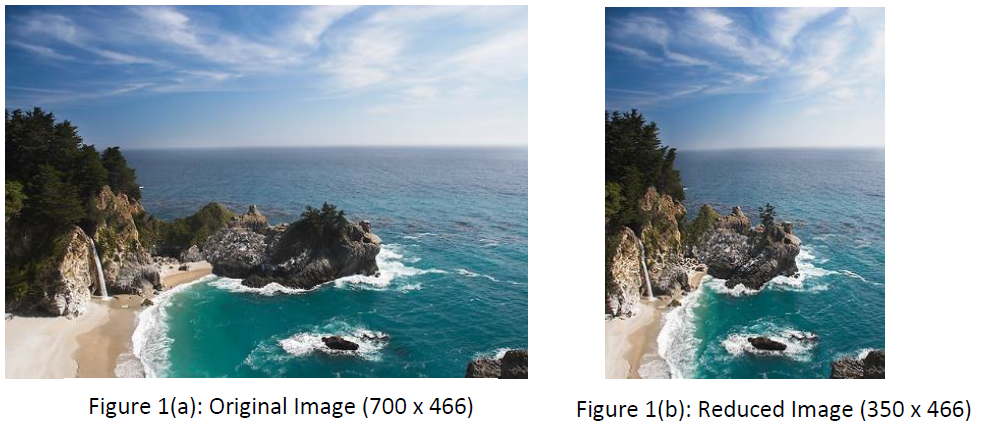
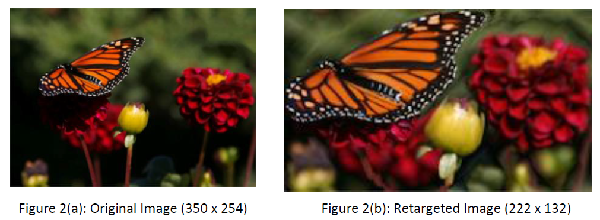
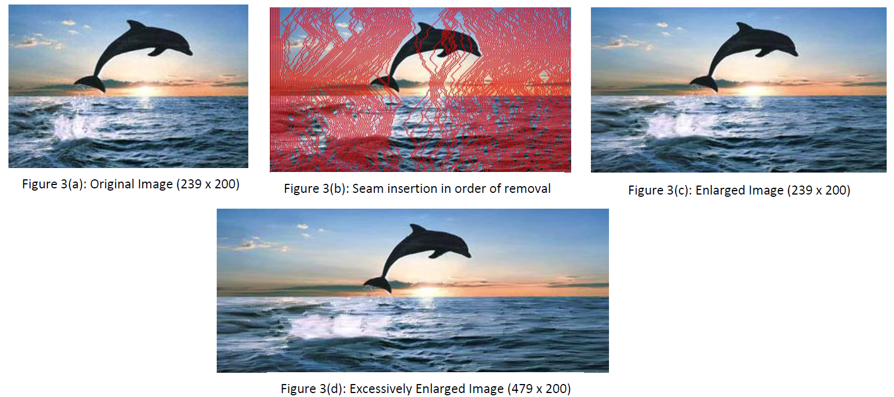

#Introduction
Seam Carving is an algorithm for content aware image re-sizing which functions by establishing many seams (paths of least importance) in an image and automatically removes seams to reduce image size or inserts seams to extend it. The purpose of the algorithm is image retargeting, which is used in displaying images on media of different sizes. To reduce the image size, cropping is limited since it can only remove pixels from image periphery. Also, Image scaling is not helpful as it can only be applied uniformly across pixels.
Seam carving uses an energy function defining importance of pixels. A seam is a connected path of low energy pixels either top to bottom or left to right. By successfully removing or inserting seams we can reduce or enlarge an image. In this project, I am going to illustrate the application of seam carving for reduce image size image retargeting and Image Enlarging.

### Instructions to Run the Code ###

- Execute main.py using command python main.py from VM.
- There is no need of any external libraries. Libraries available in CompPhoto environment will do the job.
- Keep the input image files in same directory as python files (main.py and functions.py)
- All the output images will be generated in the same local directory
- Seam reduction function will take input as "fig5.png" and generate output "fig5_output.png"
- Image enlarge function will take input as "fig8.png" and generate output file "fig8c_output" and "fig8d.png"
- For extra enlarging, enlarge function will take "fig8d.png" as input and generate "fig8e.png".
- Image retargating function will take "fig7.png" as input and generate "fig7_output.png" and "transport map.png" as outputs.

## Vertical Image Reduction

## Vertical & Horizontal image reduction

## Image Enlargement
